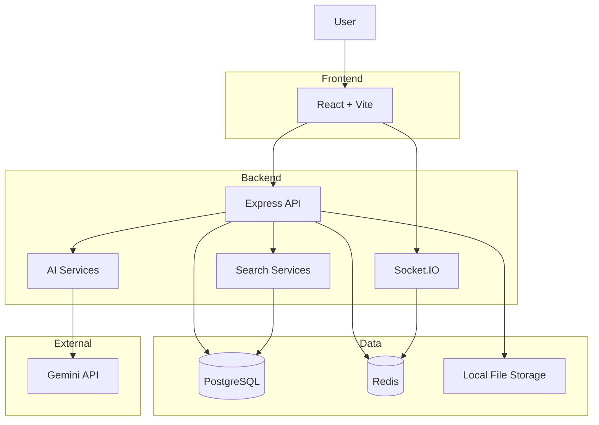
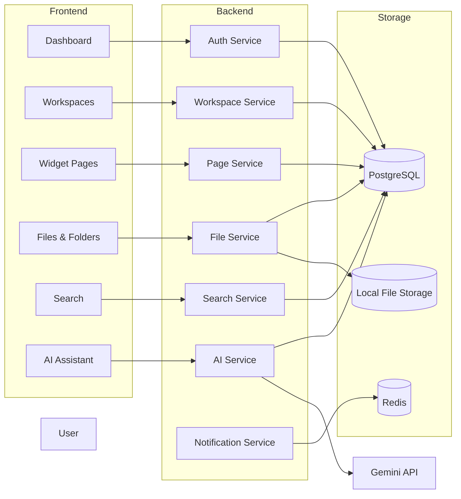
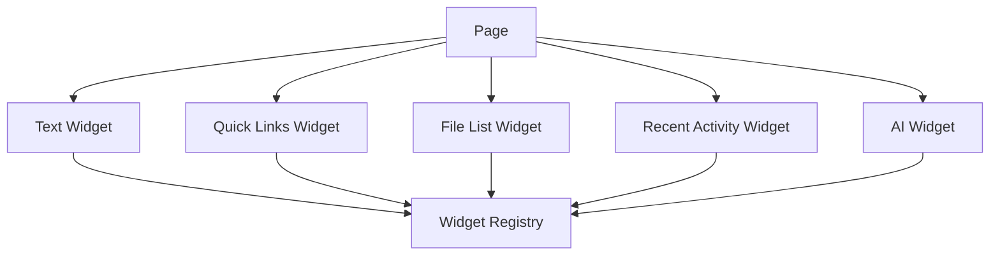

# Architecture

## Overview

## Application Architecture

## Widget Framework

## Key Decisions

- Single-tenant architecture for v1
- Designed to support multi-tenancy in the future
- Widget-based page system inspired by SharePoint
- Real-time updates using Socket.IO
- Local file storage for uploaded content
- PostgreSQL as the primary database
- Redis for caching and real-time features
- Gemini API for AI-powered capabilities
- Docker Compose for local development and deployment
